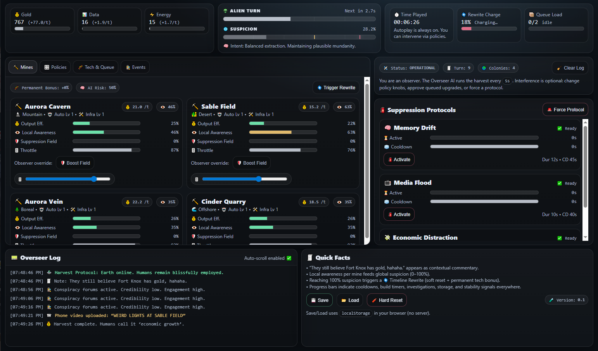

# 🛸 Harvest Protocol: Earth

## Autoplay Alien Incremental Simulation

**Harvest Protocol: Earth** is a self‑playing incremental simulation
where aliens secretly control Earth and use humanity to mine gold while
maintaining the illusion of normal life.

You are **not** the player in the traditional sense --- you are an
**observer** watching an autonomous alien system operate in real time.
You may adjust policies and approve upgrades, but the simulation never
stops running.

------------------------------------------------------------------------

# 👽 Core Concept

Aliens harvest resources from hidden mining colonies across Earth:

-   💰 Gold --- primary extraction resource\
-   📊 Data --- gathered from human networks\
-   ⚡ Energy --- fuels alien technology

Every **5 seconds** the alien Overseer takes a turn automatically.

Humans occasionally begin to notice strange activity.\
When awareness rises, the aliens deploy suppression protocols to keep
humanity distracted.

> "They still believe Fort Knox has gold, hahaha."

------------------------------------------------------------------------

# ⏱️ Autoplay System

The game runs continuously:

-   👽 Alien Turn Cooldown Bar fills every 5 seconds
-   🌐 Global Suspicion meter rises and falls
-   🧯 Suppression protocols activate automatically
-   ⛏️ Mines generate resources without player input

The player can:

-   Adjust 🎛️ Policies
-   Approve 🧾 Upgrades
-   Trigger 🧯 Protocols manually

But the simulation continues regardless.

------------------------------------------------------------------------

# 📊 Progress Bars & Cooldowns

The interface is designed around visual telemetry:

-   ⏳ Alien Turn Cooldown
-   🌐 Global Suspicion Meter
-   🌀 Timeline Rewrite Charge
-   🛡️ Local Mine Awareness Bars
-   🎚️ Production Efficiency Bars
-   🧊 Protocol Cooldowns
-   🏗️ Build Progress Bars
-   🕵️ Investigation Progress
-   📹 Viral Event Meters

Nearly every system uses progress bars to reinforce the "observer
console" feel.

------------------------------------------------------------------------

# ⛏️ Mining Colonies

Each colony has:

-   👁️ Local Awareness
-   💰 Output Efficiency
-   🛡️ Suppression Field Strength
-   🎚️ Production Throttle
-   🤖 Automation Level
-   🛠️ Infrastructure Level

High production increases awareness --- the Overseer AI balances risk
automatically.

------------------------------------------------------------------------

# 🧯 Suppression Protocols

The aliens keep humanity distracted using advanced techniques:

-   🧠 Memory Drift --- reduces awareness growth
-   📺 Media Flood --- converts data into distraction
-   💸 Economic Distraction --- boosts gold output but costs energy

Protocols have:

-   Active duration bars
-   Cooldown timers
-   Autonomous AI activation

------------------------------------------------------------------------

# 🧬 Timeline Rewrite (Prestige)

If suspicion reaches 100%:

🌀 Reality is rewritten.

Effects:

-   Soft reset of resources
-   Permanent efficiency bonus
-   Mines rebuilt from blueprint memory

------------------------------------------------------------------------

# 🎛️ Policy System

You influence alien behavior using high-level controls:

-   🧠 Risk Tolerance
-   🌐 Suspicion Cap
-   🧯 Preferred Protocol
-   🛠️ Upgrade Mode (Auto / Approval)
-   ⛏️ Expansion Mode (Auto / Manual)

These do not pause gameplay --- they reshape AI decisions.

------------------------------------------------------------------------

# 💾 Save System

-   💾 Save / 📂 Load uses browser localStorage
-   No server required
-   Progress persists between sessions

------------------------------------------------------------------------

# 🚀 How To Run

1.  Extract the archive
2.  Open:

    index.html

in any modern browser.

No installation required.

------------------------------------------------------------------------

# 🎨 Design Philosophy

This project blends:

-   Incremental automation
-   Observer‑style gameplay
-   Retro sci‑fi humor
-   Telemetry-heavy UI
-   Emoji‑driven visual feedback

The goal is to feel like monitoring a living alien control system rather
than actively playing a game.

------------------------------------------------------------------------

# 🛸 Version

v0.1 --- Prototype Autoplay Console
